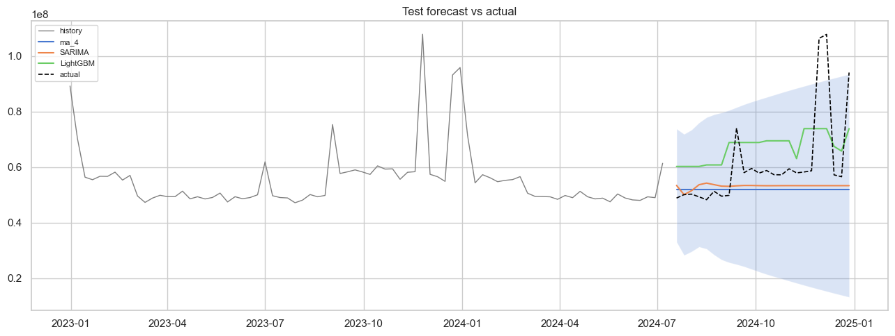

# Retail Weekly Sales Forecasting

Прогноз **недельных** продаж на горизонт 8–16 недель.

Датасет: [Retail Store Sales Forecasting Dataset](https://www.kaggle.com/datasets/noopurbhatt/retail-store-sales-forecasting-dataset) (Kaggle).

Три файла:

| File | Содержание |
|------|------------|
| `sales.csv` | `store_id`, `department`, `date`, `weekly_sales`, `is_holiday` |
| `stores.csv` | `store_id`, `store_type`, `store_size`, `region` |
| `features.csv` | температура, fuel_price, markdown_1..5, CPI, unemployment, holidays |

По умолчанию строится **агрегированный ряд**: сумма `weekly_sales` по всем магазинам и отделам на каждую неделю. Можно ограничить `store_id` / `department`.

Метрики: MAE, RMSE, MAPE. Сплит строго по времени (70 / 15 / 15).

## Структура

```
.
├── data/                         # положите сюда sales.csv, features.csv, stores.csv
├── notebooks/
│   └── time_series_forecasting.ipynb
├── src/
│   ├── data_loader.py            # чтение 3 CSV, агрегация, merge features
│   ├── features.py               # лаги (1..52), rolling, calendar, external regressors
│   ├── preprocessing.py
│   ├── train.py                  # naive, MA, SARIMA(s=52), Prophet, LightGBM/XGB
│   ├── evaluate.py
│   └── utils.py
├── models/
├── predict.py
├── requirements.txt
└── README.md
```

## Установка

```bash
python -m venv .venv
source .venv/bin/activate
pip install -r requirements.txt
```

## Данные

```bash
mkdir -p data
# скопируйте sales.csv, features.csv, stores.csv в data/
```

Без файлов в `data/` `load_data()` вернёт короткую синтетическую заглушку (только чтобы код не падал). Для реальных экспериментов нужны CSV из Kaggle.

## Запуск

```bash
jupyter notebook notebooks/time_series_forecasting.ipynb
```

```bash
# один магазин
python predict.py --data-dir data --store-id 1 --horizon 12 --model models/best_model.joblib

# весь агрегат
python predict.py --data-dir data --horizon 12 --model models/best_model.joblib
```

## Подход

1. **Загрузка** — `sales` + `features` + `stores`, нормализация имён колонок (поддержка `Weekly_Sales` / `weekly_sales` и т.п.).
2. **Ряд** — сумма продаж по неделям; внешние признаки усредняются по магазинам на дату.
3. **EDA** — график, seasonal_decompose (period=52), ADF, ACF/PACF.
4. **Модели**
   - naive / MA(4) — baseline;
   - SARIMA с сезоном 52 (если ряд достаточно длинный);
   - Prophet (yearly seasonality, `is_holiday` как regressor);
   - LightGBM / XGBoost: лаги 1,2,4,8,12,52; rolling 4/8/12; calendar; temperature, CPI, fuel, markdowns.
5. **ML multi-step** — рекурсивный прогноз; внешние регрессоры на горизонте = last observation carried forward.

## Результаты

Тестирование проводилось на отложенной выборке (последние 24 недели). Основные метрики:

| Модель | MAE | RMSE | MAPE (%) |
|--------|-----|------|----------|
| LightGBM (рекурсивный) | 13 278 781 | 14 959 440 | 21.21 |
| Naive (последнее значение) | 11 263 910 | 16 656 910 | 16.46 |
| SARIMA | 10 468 610 | 18 559 080 | 13.37 |
| MA(4) | 11 091 450 | 19 221 130 | 14.19 |

**Лучшая модель:** LightGBM с рекурсивным прогнозом (RMSE = 14.96 млн).


## Выводы

- Weekly данные → сезонность годовая (52), а не «дневная неделя».
- Внешние регрессоры (CPI, unemployment, fuel, markdowns) полезны для ML; для SARIMA их можно добавить через SARIMAX.
- Рекурсивный ML на длинном горизонте накапливает ошибку; для 8–12 недель обычно приемлемо.
- Суммирование продаж по всем магазинам сглаживает шум, но нивелирует различия между отдельными точками — для операционных решений лучше строить модель на уровне магазина/отдела.

## Что можно улучшить

- SARIMAX с `exog` (temperature, is_holiday, markdowns) вместо чистого SARIMA.
- Отдельные модели на store_id / department или global model с store_id как категорией.
- Календарь праздников на горизонт прогноза вместо LOCF для `is_holiday`.
- Time-series CV (rolling origin), а не один split.
- Иерархические прогнозы (dept → store → chain) с reconciliation.
- Quantile regression / conformal intervals для boosting.

## Воспроизводимость

`random_state=42`. Версии — в `requirements.txt`.
